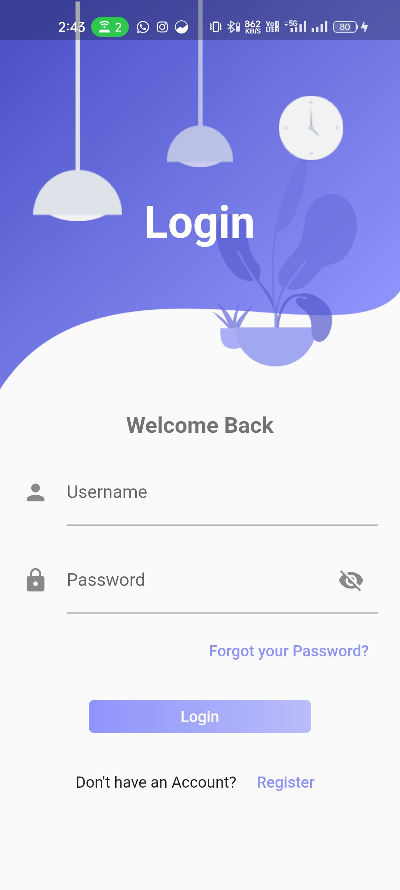
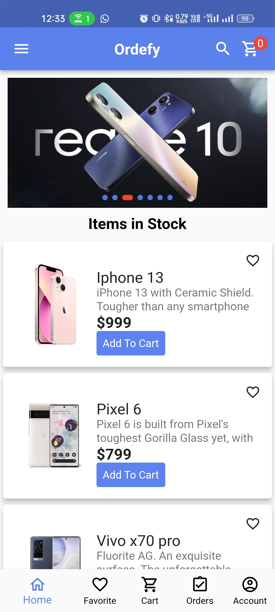
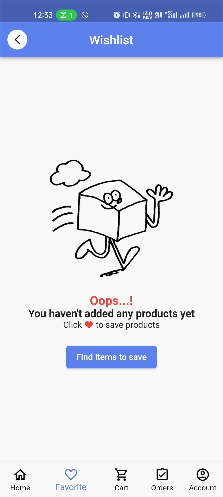
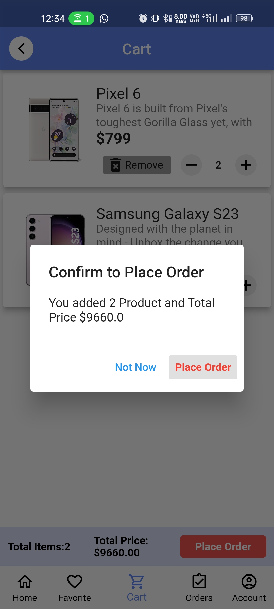
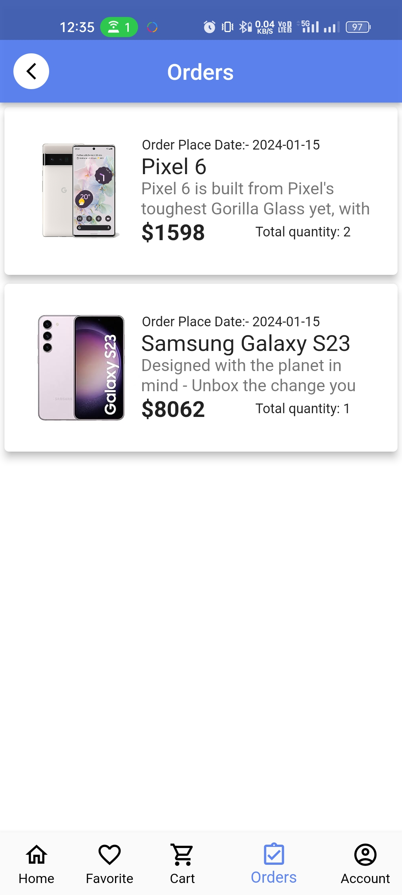
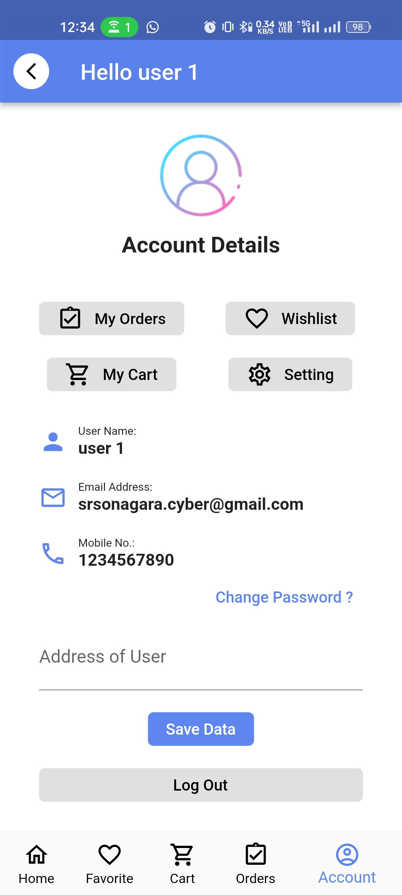

<h1 align="center">Online Ordering System App</h1>

  The Online Ordering System App is a Flutter application that allows users to perform various actions related to online shopping, including user authentication, browsing a list of items, adding items to watch and cart lists, placing orders, and viewing order history.

  
  
  
  
  
  
  

## Features

- **User Authentication**
    - Users can register and log in using their Gmail accounts.
    - Account verification is done through OTP sent to the registered email.

- **Item Listing**
    - Fetches a list of items from the API.
    - Users can browse through available items.

- **Watch List**
    - Users can add items to their watch list for future reference.

- **Cart Management**
    - Users can add items to their shopping cart.
    - Cart shows a summary of selected items with the option to adjust quantities.

- **Order Placement**
    - Users can place an order with items from their cart.
    - Notification is sent to the user after a successful order placement.

- **Order History**
    - Users can view their order history with details of past orders.

## Note:

 Here i created this app using different state management.
  - provider
  - GetX
  - Bloc-cubit